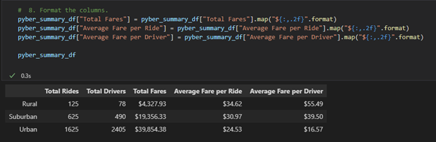
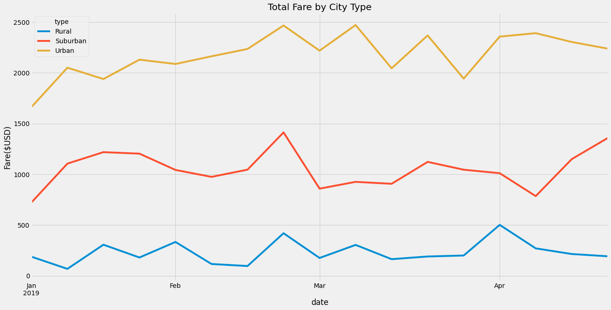
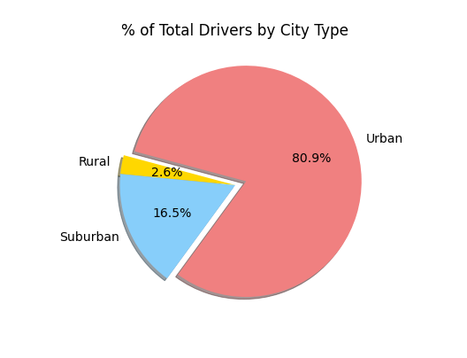
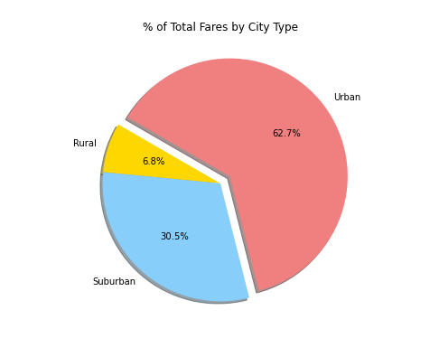

# PyBer Analysis

## 1. **Overview of the analysis** 
Scenario: The CEO at PyBer has given me and my manager a brand-new assignment. Using my Python skills and knowledge of Pandas, I will create a summary DataFrame of the ride-sharing data by city type. Then, using Pandas and Matplotlib, I will create a multiple-line graph that shows the total weekly fares for each city type. The purpose of this written report is for me to hone my Data Analyst skills acting as an employee at PyBer and create a complete summary of the Ride-Sharing data by city type. This including a quick summary mulitple-line chat using Matplotlib and the Final Analysis will conclude the my findings and recommendations to the CEO based off the analysis of the multiple-line graphs of total weekly fares for each city type.

## 2. **Results** 
 
    > * The Urban fares are at an average of $1,800 with a consistent increase to ~$2,300. 
    > * The Suburban fares are at approximately ~$1,000 and was not profitable, fare rates dropped in March as well as in April. 
    > * The Rural fares are at approximately ~$200, fares increase and dropped till the end of April. 
    
    > The PyBer summary DataFrame

     > A multiple-line chart of total fares for each city type

    
3. **Summary and Recommendations** 

    > **1.** Referencing the completed analysis and by creating additional graphs to convey additional information, we can predict a few things that would present the company with opportunities to expand the business among rural and suburban populations. One of these oppotunities that I would recommend would be to potentially hire more drivers to operate their ride-sharing businesses in rural and suburban areas.

    > % of Total Drivers by City Type
    
    
    > **2.** Ride-sharing fare is the highest and most consistent in Urban areas, giving the company great and new business opportunities to expand rides and increase profit margins by targeting Urban areas.  

    > % of Total Fares by City Type
    
    
    > **3.** Ride-sharing fare is the lowest in rural areas compared to Urban and Suburban areas, in addition, fares never intersect in the graph shown below. By having access to this information that all fares never intersect, fares can be expanded and increase business financial income to the company without affecting our rates.

     > Total Fare by City Type
     